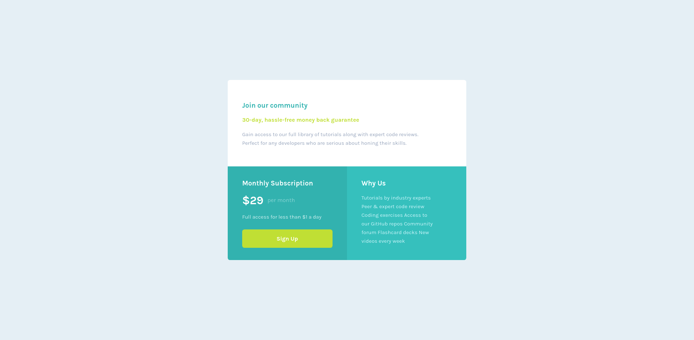

# Frontend Mentor - Single price grid component solution

This is a solution to the [Single price grid component challenge on Frontend Mentor](https://www.frontendmentor.io/challenges/single-price-grid-component-5ce41129d0ff452fec5abbbc).

## Table of contents

- [Overview](#overview)
  - [The challenge](#the-challenge)
  - [Screenshot](#screenshot)
  - [Links](#links)
- [My process](#my-process)
  - [Built with](#built-with)
  - [Useful resources](#useful-resources)
- [Author](#author)

## Overview

### The challenge

Users should be able to:

- View the optimal layout for the component depending on their device's screen size
- See a hover state on desktop for the Sign Up call-to-action

### Screenshot

### Links

- Solution URL: [Add solution URL here](https://your-solution-url.com)
- Live Site URL: [Add live site URL here](https://your-live-site-url.com)

## My process

### Built with

- Semantic HTML5 markup
- Sass variables
- CSS Grid
- Mobile-first workflow

### Useful resources

- [Basic Concepts of grid layout](https://developer.mozilla.org/en-US/docs/Web/CSS/CSS_Grid_Layout/Basic_Concepts_of_Grid_Layout) - This article helped me to understand the grid layout.

- [Lighten And Darken With CSS Brightness Filter](https://til.hashrocket.com/posts/4jhm8rrq7c-lighten-and-darken-with-css-brightness-filter) - This helped me for the brightness of box3.

## Author

- My GitHub profile - [Costi Voicu](https://github.com/CostiVoicu)
- Frontend Mentor - [@JustAFatRaccoon](https://www.frontendmentor.io/profile/JustAFatRaccoon)
- Twitter - [@VoicuCosti2](https://twitter.com/VoicuCosti2)
- Instagram - [@c0stiv0icu](https://www.instagram.com/c0stiv0icu/)